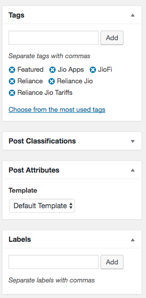
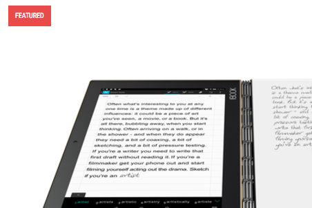

# Special Tags Metabox

A post has tags. Some tags need to be special. In a project, we needed a way for the user to attach *labels* to posts that were displayed in the post header on home, archives and elsewhere. These labels also needed to be tags.

So all labels are tags but all tags are not labels. If you need to differentiate some tags of a post as special, this will come in handy.

This helper class lets you recreate the tags metabox and help store some tags in the post meta to differentiate them from other tags that the post has.

## Usage

Include the class anywhere in your plugin or theme and instantiate it with:

```php
$label_args = array(
	'ID' => 'post_label',
	'title'	=> 'Labels',	
);

$labels = new Special_Tags_Metabox( $label_args );
```




Then you can get the ids and names of tags that are special by

```php
$labels = get_post_meta( $post_id, 'post_label', true);
```




## FAQ

**Where are the special tags stored?**

They are stored as regular tags. In addition their IDs and names are stored in the post meta with the key provided in the `ID` argument on instantiation.

**Can the user create new tags through this metabox?**

Yes. When creating a new special tag, it'll be added to the existing tags *and* stored in the post meta. 
